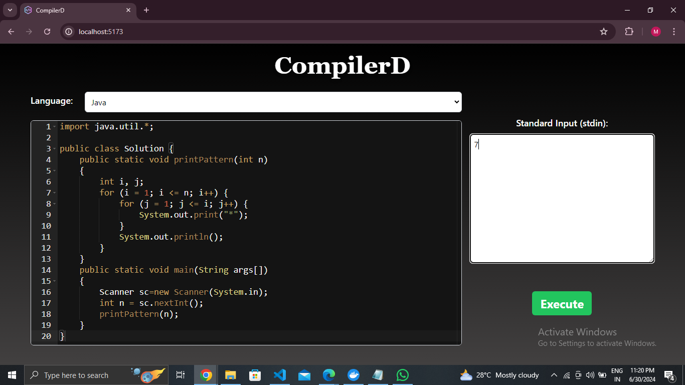
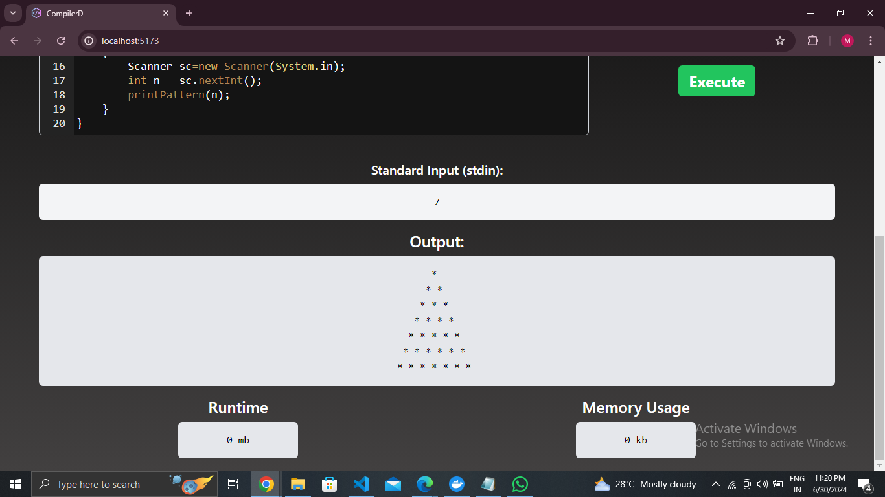

# CompilerD

# Quick Usage :

1. Clone the Repository:
git clone https://github.com/your-username/your-repo-name.git

2. Navigate to the Project Directory:
cd your-repo-name

3. Run the Backend Server

4. cd frontend

5. npm install

6. npm run dev